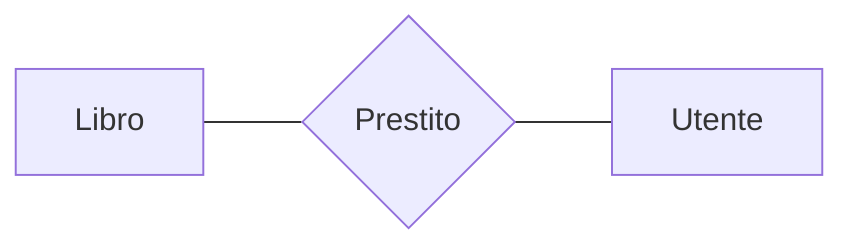

#basi-di-dati #secondo-anno 

## Associazioni (Relazioni)

### Introduzione

- Rappresentano relazioni logiche tra due o più [[Entità (Modello ER)|entità]]. 
- Ogni associazione possiede degli [[Attributi (Modello ER)|attributi]] che ne descrivono le proprietà.
- Una istanza di una relazione è detta occorrenza
- L'insieme delle occorrenze di una relazione è un insieme di elementi aventi tutti la stessa struttura. 
- Esistono anche relazioni ricorsive

### Rappresentazione

- Ogni relazione ha un nome che la identifica univocamente nello schema:
	- I nomi devono essere espressivi.
	- I nomi devono essere al singolare.
	- Si usano i sostantivi anziché verbi.

### Cardinalità

La cardinalità di una relazione rappresenta quante volte una istanza di una entità può essere coinvolta nella relazione. In genere i valori utilizzati vanno sono 0, 1, N

- Se la cardinalità è 0 --> la partecipazione dell'entità alla relazione è detta opzionale
- Se la cardinalità è 1 --> la partecipazione dell'entità alla relazione è detta obbligatoria

Relazioni molti a molti

Relazioni uno a molti

Relazioni uno a uno

### Limiti di Una Relazione Binaria

Non è possibile che uno studente sostenga (non superi) più volte lo stesso esame

se aggiungo una data sul sostenimento dell'esame sono in grado di distinguere le coppie mediante le diverse date. Posso oppure usare una rappresentazione ternaria![[Screenshot 2024-09-12 alle 15.46.49.png]]

---

#### Referenze

- Vedi anche: 
- Vedi anche:
