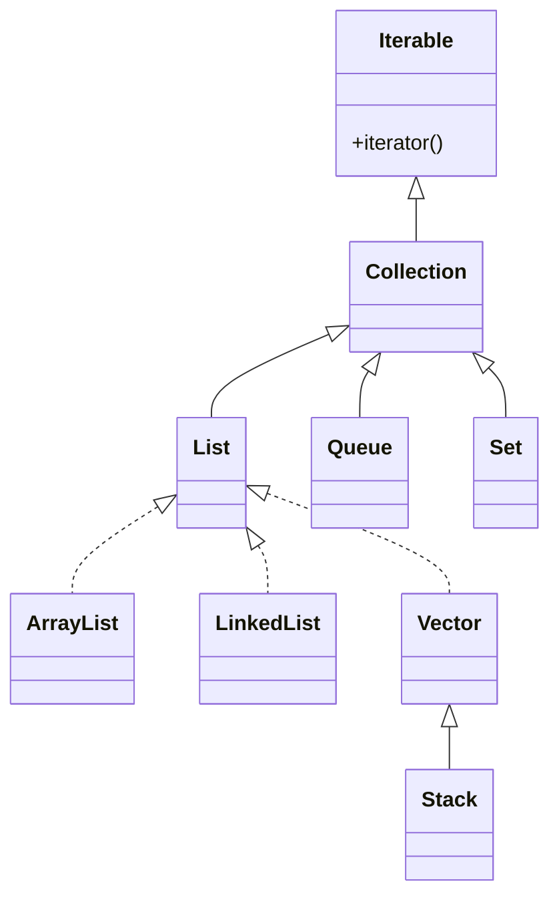

#tag #tag

## Collection Framework

- **Framework:** ambiente software riutilizzabile che fornisce funzionalità per velocizzare lo sviluppo di applicazioni
- **Collection framework:** è una tipologia di framework che fornisce un'architettura per manipolare e archiviare gruppi di oggetti. Supporta tutte le operazioni classiche sui dati, come ricerca, ordinamento, inserimento, manipolazione ed eliminazione

Il Java Collection Framework è costituito dai seguenti elementi:

1. le interfacce che definiscono le operazioni classiche di una generica collezione di oggetti.
2. le classi concrete che implementano le interfacce utilizzando differenti tipi di strutture dati.
3. gli algoritmi di ricerca e di ordinamento utilizzati dalle classi concrete.

Le interfacce possono essere suddivise in due macro-categorie:

1. le Collection che sono ottimizzate per operazioni di inserimento, modifica e cancellazione di elementi all'interno di un insieme di oggetti;
2. le Map che sono ottimizzate per operazioni di ricerca.



### Arraylist

Utilizza un array dinamico per memorizzare gli elementi, mantiene l'ordine di inserimento e permette l'accesso ai suoi elementi in modo casuale.

```java
import java.util.ArrayList;

public class Main {
    public static void main(String[] args) {
        // Creiamo una ArrayList di String
        ArrayList<String> arrayList = new ArrayList<>();

        // Aggiungiamo degli elementi alla ArrayList
        arrayList.add("Mario");
        arrayList.add("Luigi");
        arrayList.add("Peach");

        // Stampa gli elementi
        System.out.println("Elementi di ArrayList:");
        for (String name : arrayList) {
            System.out.println(name);
        }

        // Accesso casuale: prendi l'elemento all'indice 1 (Luigi)
        System.out.println("Elemento all'indice 1: " + arrayList.get(1));  // Output: Luigi
    }
}
```

### Linkedlist

La classe LinkedList utilizza liste concatenate doppie per memorizzare gli elementi, implementa l’interfaccia Dequeue e mantiene l'ordine di inserimento degli elementi

---

### Referenze

1. 

---
**Tags**: 