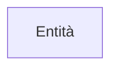

#basi-di-dati #secondo-anno 

## Entità

### Introduzione

- È un costrutto del [[Modello Entità-Relazione|modello entità-relazione]] 
- Rappresenta una classe di oggetti con proprietà comuni, esistenza propria, indipendentemente dall'applicazione.
- Ogni entità possiede degli [[Attributi (Modello ER)|attributi]] che ne descrivono le proprietà.
- Una istanza di una entità è detta occorrenza.

### Rappresentazione

- Ogni entità ha un nome che la identifica univocamente nello schema: 
	- I nomi devono essere per quanto possibile espressivi – 
	- Si usa il singolare
- Nel diagramma entità-relazione, il simbolo utilizzato per rappresentare una entità è il rettangolo.

---

#### Referenze

- Vedi anche: 
- Vedi anche:
