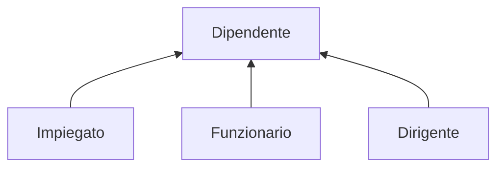

#basi-di-dati #secondo-anno 

## Introduzione

Rappresentano legami logici fra una entità padre $E$ e una o più entità figlie $E_{n}$ che si possono tradurre come casi particolari dell'entità padre. 

- $E$ è una generalizzazione per $E_{1},E_{2},\dots,E_{n}$
- $E_{1},E_{2},\dots,E_{n}$ sono specializzazioni di $E$

## Proprietà

1. Ogni occorrenza di un'entità figlia è anche un'occorrenza dell'entità padre.
2. Ogni proprietà dell'entità padre è anche proprietà dell'entità figlia.

Una generalizzazione è detta:

- **Parziale:** 
- **Totale:** ogni occorrenza dell'entità padre è anche occorrenza di almeno una delle figlie
- **Esclusiva:** ogni occorrenza dell'entità padre è un'occorrenza dl più di una delle figlie
- **Sovrapposta**

## Gerarchie

Sono strutture che permettono di organizzare e rappresentare dati su diversi livelli di astrazione.

Se un'entità padre ha solo una entità figlia si parla di sottoinsieme.

## Esempioxo

### Rappresentazione

---
- Vedi anche: 
- Vedi anche:
